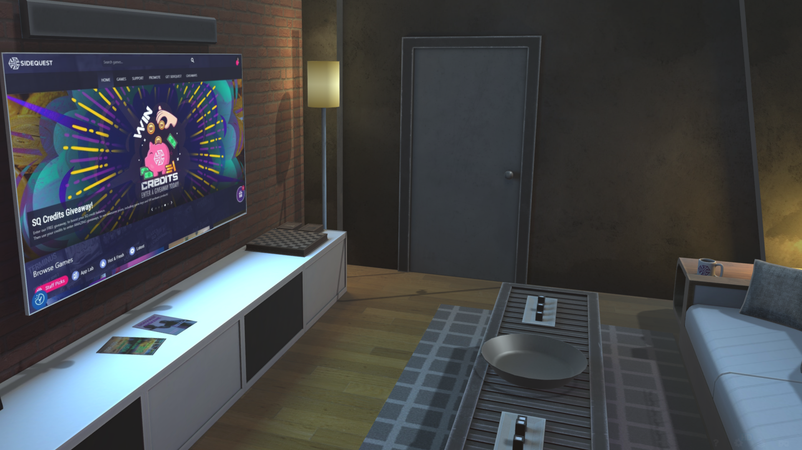
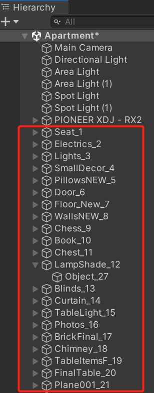
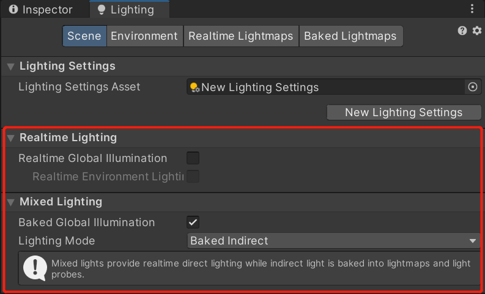
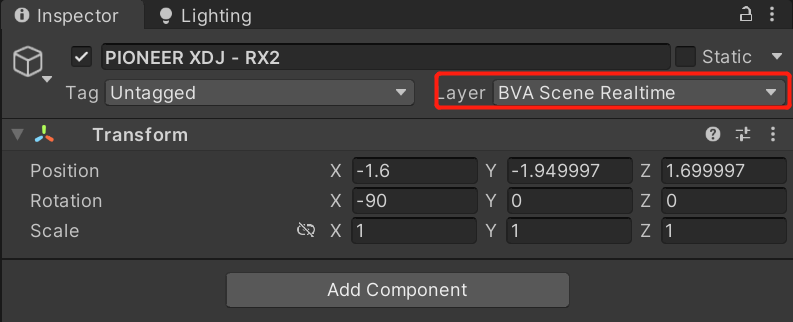
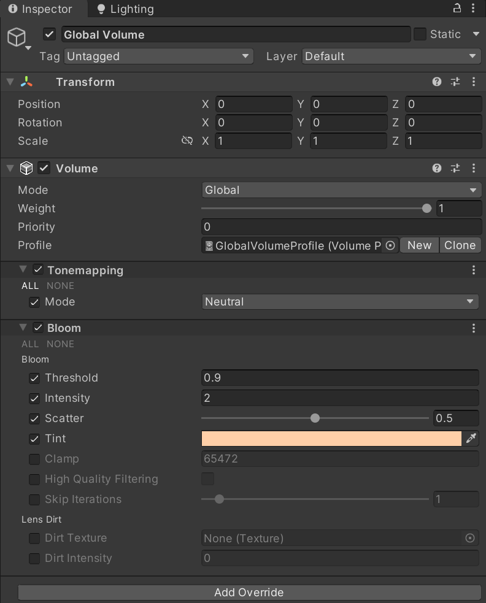
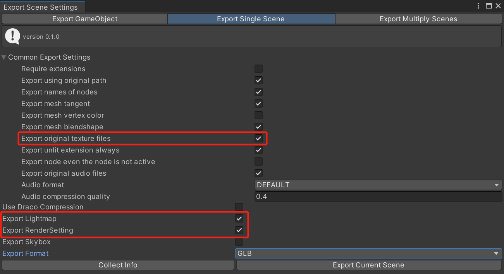
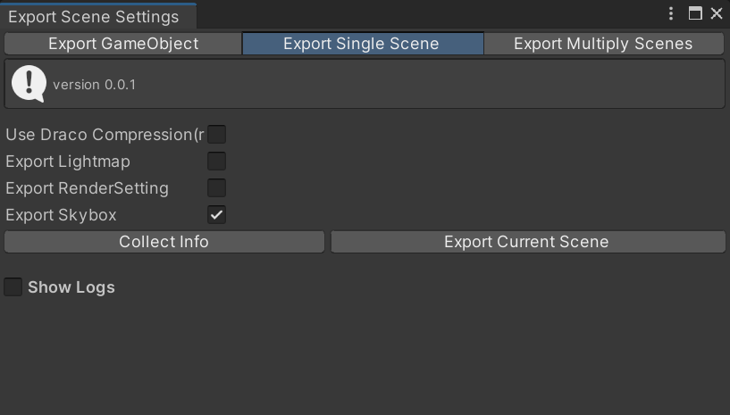
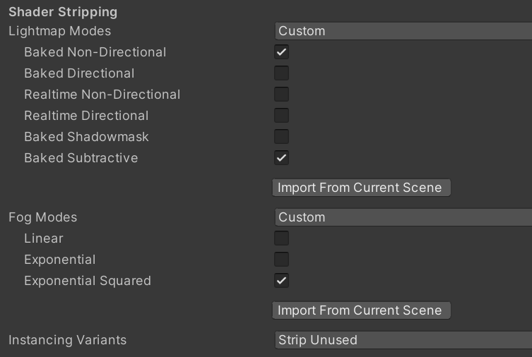

# Scene Export

## Export Sample

In order to explain the workflow of BVA import and export in detail, the following demonstrates the import of gltf resources downloaded from the Internet to the project, and then configured and output as a BVA scene file.

1. Download a room model and a DJ Mixer model from `Sketchfab`

sydney-apartment-night             |  pioneer-xdj
:-------------------------:|:-------------------------:
  |  

2. Unzip the downloaded file and drag the entire folder of the model into the Unity resource bar

Wait a while for the imported resources to be generated

You can also see the Preview view on the right, at which point you can drag the file directly into the scene like FBX, and Unity will treat it as a Prefab

3. Create a new empty scene, add lights and cameras, add two `Area Lights` in the room and drag them to the right size, place one on both sides of Y axis, place two `Spot Lights`, set the material of the two lights to self-illuminating and set to `Baked Global Illumination`, so that all the baked lights are set

4. Adjust the overall scale of the room, and drag all the objects out to the root directory, so that the exported scenes can be displayed one by one when loading, so that the loading process looks more coherent

5. Set all objects in the room to static and set the level of objects to `BVA Scene Static(Lightmap)`, this level is used to bake static objects

6. Open the Lighting Settings panel and uncheck `Realtime Global Illumination`, check `Backed Global Illumination`, set each baking parameter and click `Generate Lighting` bake the scene and wait a few minutes for the baking to finish

7. Add a `Directional Light`，set to `Realtime` mode, and set `Culling Mask` to `BVA Scene Realtime`, then drag the DJ Mixer into scene, set Layer to `BVA Scene Realtime`, only in this way this DJ Mixer will be affected by this realtime light.

8. At last, add post-process, on `Hierarchy` panel, right click `Volume/Global Volume`. Then add `Bloom` and `Tonemapping`。

9. Open export panel by Editor menu `BVA/Export/Export Scene`, select `Export Single Scene`, check `export original texture`, this will improve the quility of export model, then check the `Export RenderSetting` & `Export Lightmap`. In general, only the scene where the baking is used needs to check these two items.

10. The output file can be loaded Sample, either in Editor and build applications, click on the image below to see the loading state on the mobile platform

## Export inside editor supports all features. Three types exporting method

1. Export Root GameObject with all its childs

1. Export Single Scene

1. Export Multiple Scene

## Settings
- NonSkin Mesh(mesh renderered by `MeshRenderer` instead of `SkinnedMeshRenderer`) can apply [google draco](https://github.com/google/draco) compression.It is intended to improve the storage and transmission of 3D graphics.

- When you try to export a scene with baked lighting. Lightingmap will be created in your project. To correctly export lightmap, make sure toggele off the `Realtime Global Illumination`,and Turn on the `Baked Global Illumination` at `Lighting` setting panel.

- RenderSettings contains some global settings, which can access from static class `UnityEngine.RenderSetttings`, most of info can also altered by hand through `Environment` tab on `Lighting` panel

- To decrease the shader variants, we highly recommend that you only use `Exponential Squared` mode as the only fog mode. This can be modified in `PlayerSetting/Graphics` Tab.

- Skybox export