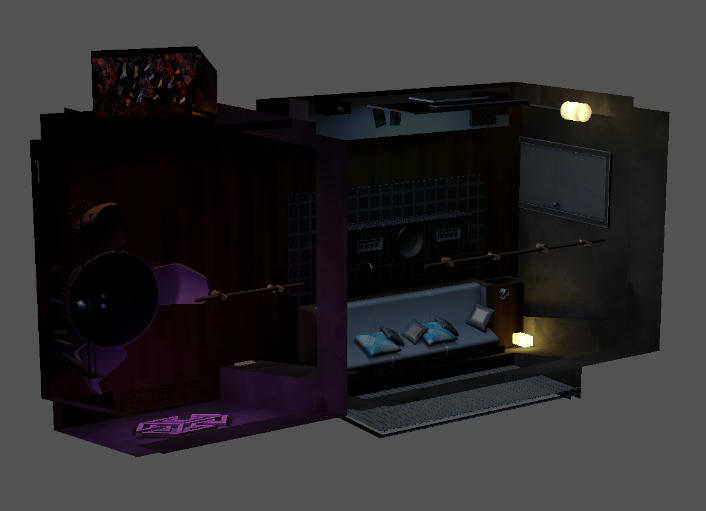
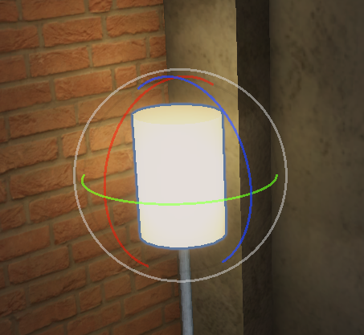
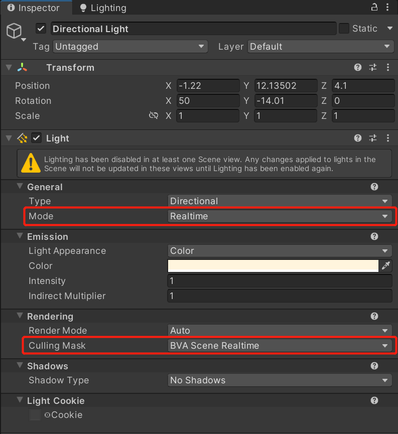
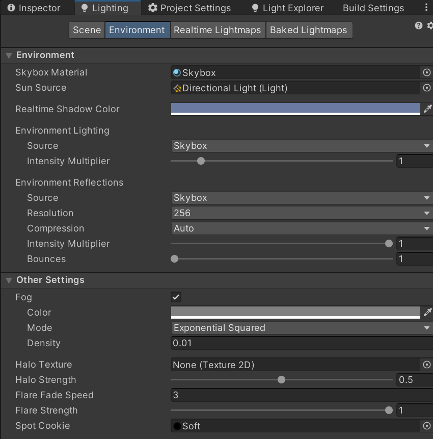

# 场景导出

## 导出示例

为了详细的向大家解释一下BVA的导入导出的工作流程，以下演示了导入从互联网上下载获取的gltf资源到工程里，配置后输出为BVA的场景文件。

1. 从`Sketchfab`上下载一个房间的模型和一个打碟器的模型

sydney-apartment-night             |  pioneer-xdj
:-------------------------:|:-------------------------:
  |  

2. 解压下载的文件，将模型的整个文件夹拖进Unity的资源栏里

等待一会处理完就会生成导入后的资源

并且可以在右边看到Preview视图，此时可以像FBX那样直接将文件拖进场景，Unity会当成Prefab处理

3. 新建一个空场景，添加灯光和相机，在房间里添加两个`Area Light`拖到合适的大小，上下方向上都各放置一个，并放置两个`Spot Light`，将两盏灯光的材质设置为自发光并设置为Baked Global Illumination，这样就设置好了所有的烘焙光

4. 调整下房间的整体缩放，并将物体全部拖出来放到根目录下，这样导出的场景，能在加载的时候一个一个显示出来，让加载过程看起来更有连贯性

5. 将房间里的所有物体并设置为静态，并设置物体的层级为`BVA Scene Static(Lightmap)`，这个层级用于烘焙静态物体

6. 打开Lighting设置面板，取消勾选`Realtime Global Illumination`，选择勾选`Backed Global Illumination`，设置各项烘焙参数后点击`Generate Lighting`烘焙场景，等待几分钟完成烘焙

7. 添加一个`Directional Light`，设置为`Realtime`实时光，并设置`Culling Mask`为`BVA Scene Realtime`，然后将打碟器拖进场景中，设置Layer为`BVA Scene Realtime`，这样只有这个打碟器会受到这个实时光的影响

8. 最后添加一个后处理，在`Hierarchy`右键选择`Volume/Global Volume`。然后添加`Bloom`和`Tonemapping`，并勾选Camera的Post Processing。

9. 打开导出面板，通过菜单栏`BVA/Export/Export Scene`打开导出的面板，选择`Export Single Scene`，点击勾选export original texture，这样尽可能的导出原图片提高导出的质量，再勾选导出RenderSetting和Lightmap导出这个场景，一般的只有用到了烘焙的场景才需要勾选这两项

10. 输出的文件可以在各种Sample打包出来的应用里加载，点击下图查看在移动端的加载情况

## 导出面板

> Editor导出支持所有的功能，Runtime下部分功能不支持导出（如动画）

1. 导出Root物体及其所有子物体

2. 导出单个场景

3. 导出多个场景

## 设定

- 非蒙皮网格（由`MeshRenderer`而不是`SkinndMeshRenderer`渲染的网格）可以使用[google draco](https://github.com/google/draco)进行压缩。其目的是改善三维图形的存储和传输。

- 当您尝试导出具有烘焙照明的场景时。Lightingmap将在项目中创建。要正确导出光照贴图，请确保关闭`Realtime Global Illumination`，并在`Lighting`设置面板上打开`Baked Global Illumination`。

- RenderSettings包含一些全局设置，可以从静态类访问`UnityEngine.RenderSetttings`, 大多数信息也可以通过手工修改 `Environment` 栏的 `Lighting` 界面。

- 为了减少着色器变体，我们强烈建议您仅使用 `Exponential Squared` 作为唯一雾模式. 这可以在`PlayerSetting/Graphics` 中修改。

- 天空盒导出